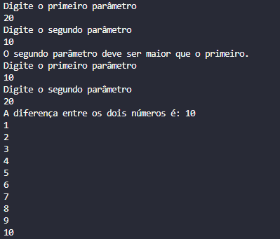

## DIO Control de Fluxo

### Sobre o projeto

Projeto com o objetivo de receber 2 parâmetros inseridos pelo usuario, após isso, ele verifica se o segundo parâmetro é maior que o primeiro, caso seja verdade, calcula a diferença entre eles e exibe a contagem em relação ao calculo.

## Screenshot

